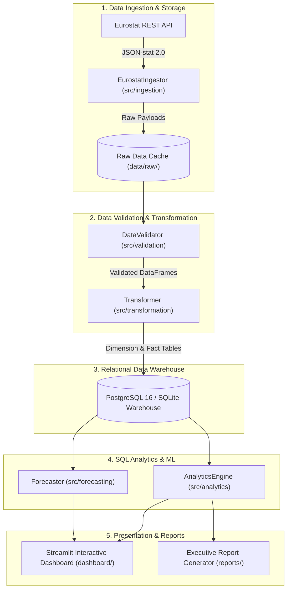
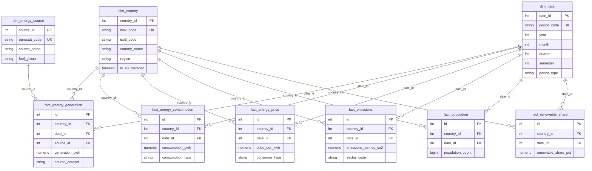

# European Energy Analytics

> **Production-grade Data Engineering & Analytics Platform analyzing 35+ years of official Eurostat energy balances, retail power tariffs, population statistics, and Sector D greenhouse gas emissions across 37 European nations.**

---

## 🚀 Live Demo

- **Deployed Dashboard**: [https://european-energy-analytics.onrender.com/](https://european-energy-analytics.onrender.com/)

---

## 📊 Project Overview

**European Energy Analytics** is an end-to-end, highly reproducible Data Engineering and Business Intelligence platform built on strict **Numerical Truth Principles**. It ingests, validates, models, analyzes, and visualizes official European Union energy and demographic data to evaluate national clean energy transitions, fuel mix shifts, power prices, carbon intensity, and per-capita energy consumption trends.

### Who & What This Project Is For:
- **Energy Analysts & Economists**: Benchmarking renewable expansion, fossil thermal phase-outs, and bi-annual household vs. industrial power tariffs across European economies.
- **Policy Makers & Strategy Teams**: Tracking national compliance with EU SHARES directive targets and evaluating historical growth trajectories (CAGR, YoY).
- **Data Engineering Portfolio Demonstration**: Exhibiting modern ETL architecture, star-schema dimensional modeling, automated data quality validation, and deterministic SQL analytics.

### Key Outputs:
- **PostgreSQL Dimensional Data Warehouse**: Star schema housing 22,612 verified fact records across 6 domain tables.
- **Interactive 12-Page Streamlit Dashboard**: Dynamic UI featuring Plotly visualizations, country deep dives, per-capita metrics, price trends, and linear trend forecasts.
- **Automated Executive Report Generator**: Dynamic Markdown document generation synthesizing multi-country KPIs and country profiles.
- **Automated Audit Engine**: Codebase hardcode scanner and mathematical truth validation suite verifying 100% data integrity against official sources.

---

## 🏗️ Architecture

The platform follows a modular, decoupled data engineering architecture built with standard Python toolchains, PostgreSQL, SQL Analytics, and Streamlit.



---

## 🔄 Data Pipeline

The ETL pipeline consists of six sequential stages, managed and executed by [`pipeline_runner.py`](file:///Users/andreastsakiris/European-Energy-Analytics/pipeline_runner.py):

1. **Data Source Ingestion** ([`src/ingestion/eurostat_ingestor.py`](file:///Users/andreastsakiris/European-Energy-Analytics/src/ingestion/eurostat_ingestor.py)):
   - Issues HTTP REST queries to Eurostat's JSON-stat 2.0 dissemination API.
   - Decodes row-major dimension strides into tabular Pandas DataFrames.
   - Caches raw API responses and timestamped JSON metadata in [`data/raw/`](file:///Users/andreastsakiris/European-Energy-Analytics/data/raw/).

2. **Data Quality & Bound Validation** ([`src/validation/data_validator.py`](file:///Users/andreastsakiris/European-Energy-Analytics/src/validation/data_validator.py)):
   - Checks schema completeness and required foreign keys (`geo`, `time`, `siec`).
   - Filters out null critical fields and duplicate combination records.
   - Clamps out-of-bounds generation values ($GWh \ge 0$), renewable percentages ($0\% \le REN\_ELC \le 100\%$), and tariffs ($0 < €/kWh \le 5.0$).
   - Flags statistical outliers using a standard Z-score threshold ($|Z| > 4.0$).

3. **Data Transformation & Dimensional Modeling** ([`src/transformation/transformer.py`](file:///Users/andreastsakiris/European-Energy-Analytics/src/transformation/transformer.py)):
   - Maps Eurostat 2-letter country codes (`EL`, `DE`, `FR`, etc.) to standard ISO-2/ISO-3 national entities and regional groupings in `dim_country`.
   - Maps standard SIEC energy codes (`RA300` Wind, `RA420` Solar PV, `RA100` Hydro, `N900H` Nuclear, `G3000` Natural Gas, `C0000X0350-0370` Coal) in `dim_energy_source`.
   - Converts time strings (`YYYY`, `YYYY-S1`/`S2`) into structured dimension rows in `dim_date`.

4. **Database Warehouse Loading** ([`database/db_manager.py`](file:///Users/andreastsakiris/European-Energy-Analytics/database/db_manager.py)):
   - Executes upsert (`INSERT ... ON CONFLICT DO UPDATE`) logic into local PostgreSQL 16 (or SQLite fallback for lightweight testing environments).

5. **SQL Analytics Engine** ([`src/analytics/analytics_engine.py`](file:///Users/andreastsakiris/European-Energy-Analytics/src/analytics/analytics_engine.py)):
   - Executes optimized SQL aggregation queries defined in [`src/analytics/sql_queries.py`](file:///Users/andreastsakiris/European-Energy-Analytics/src/analytics/sql_queries.py).
   - Computes weighted renewable shares, CAGR, YoY growth rates, per-capita metrics, and price trajectories without synthetic imputation.

6. **Presentation & Reporting** ([`dashboard/app.py`](file:///Users/andreastsakiris/European-Energy-Analytics/dashboard/app.py) & [`reports/generator.py`](file:///Users/andreastsakiris/European-Energy-Analytics/reports/generator.py)):
   - Serves an interactive 12-page Streamlit analytical Web UI.
   - Dynamically compiles Markdown executive summaries.

---

## 🗄️ Database

The warehouse utilizes a star schema optimized for fast analytical aggregations. It stores **22,612 fact records** across 6 domain fact tables and 4 dimension tables.

### Data Warehouse ER Diagram



### Table Breakdown

| Table | Type | Record Count | Description | Primary / Unique Keys |
|---|---|---|---|---|
| `dim_country` | Dimension | 37 | European nations & EU27 aggregate metadata | `country_id` (PK), `iso2_code` (UK) |
| `dim_date` | Dimension | 66 | Annual, monthly, and bi-annual date periods (1960–2025) | `date_id` (PK), `period_code` (UK) |
| `dim_energy_source` | Dimension | 12 | Standard Eurostat SIEC fuel codes and classifications | `source_id` (PK), `eurostat_code` (UK) |
| `dim_metric` | Dimension | 7 | Operational analytical metric definitions | `metric_id` (PK), `metric_code` (UK) |
| `fact_energy_generation` | Fact | 14,172 | Gross Electricity Production (`GEP`) in GWh | `id` (PK), `(country_id, date_id, source_id)` (UK) |
| `fact_energy_consumption` | Fact | 2,427 | Final electricity consumption and inland demand in GWh | `id` (PK), `(country_id, date_id, consumption_type)` (UK) |
| `fact_energy_price` | Fact | 2,450 | Household & industrial electricity tariffs (€/kWh) | `id` (PK), `(country_id, date_id, consumer_type)` (UK) |
| `fact_emissions` | Fact | 626 | Sector D GHG air emissions (Tonnes $\text{CO}_2\text{eq}$) | `id` (PK), `(country_id, date_id, sector_code)` (UK) |
| `fact_population` | Fact | 2,230 | Eurostat official population count on 1 January | `id` (PK), `(country_id, date_id)` (UK) |
| `fact_renewable_share` | Fact | 707 | Eurostat SHARES renewable electricity percentage (`REN_ELC`) | `id` (PK), `(country_id, date_id)` (UK) |
| `metadata_data_provenance` | Provenance | 7 | Ingestion URL endpoints, spatial coverage, and timestamps | `dataset_id` (PK), `dataset_name` (UK) |

---

## 📡 Data Sources

All statistical data is sourced directly from **Eurostat (Statistical Office of the European Union)** dissemination APIs:

| Source Dataset | Dataset Code | Description | Unit | Official API Endpoint |
|---|---|---|---|---|
| **Annual Energy Balances** | `nrg_bal_c` | Gross Electricity Production (`GEP`) by SIEC fuel stream | GWh | [Eurostat nrg_bal_c](https://ec.europa.eu/eurostat/api/dissemination/statistics/1.0/data/nrg_bal_c) |
| **Electricity Balances** | `nrg_cb_e` | Annual Final Electricity Consumption (`FC`) & Inland Demand (`ID`) | GWh | [Eurostat nrg_cb_e](https://ec.europa.eu/eurostat/api/dissemination/statistics/1.0/data/nrg_cb_e) |
| **Renewable Energy Shares** | `nrg_ind_ren` | Official SHARES directive renewable electricity share (`REN_ELC`) | % | [Eurostat nrg_ind_ren](https://ec.europa.eu/eurostat/api/dissemination/statistics/1.0/data/nrg_ind_ren) |
| **Household Electricity Prices** | `nrg_pc_204` | Bi-annual electricity tariffs for household consumers | €/kWh | [Eurostat nrg_pc_204](https://ec.europa.eu/eurostat/api/dissemination/statistics/1.0/data/nrg_pc_204) |
| **Industrial Electricity Prices** | `nrg_pc_205` | Bi-annual electricity tariffs for non-household consumers | €/kWh | [Eurostat nrg_pc_205](https://ec.europa.eu/eurostat/api/dissemination/statistics/1.0/data/nrg_pc_205) |
| **Air Emissions Accounts** | `env_ac_ainah_r2` | Greenhouse gas air emissions for Sector D (Electricity & Gas Supply) | Thousand Tonnes $\text{CO}_2\text{eq}$ | [Eurostat env_ac_ainah_r2](https://ec.europa.eu/eurostat/api/dissemination/statistics/1.0/data/env_ac_ainah_r2) |
| **Population Statistics** | `demo_pjan` | Population count on 1 January | Count | [Eurostat demo_pjan](https://ec.europa.eu/eurostat/api/dissemination/statistics/1.0/data/demo_pjan) |

---

## 📈 Analytics

The platform resolves core data analytics questions through parameterized SQL queries:

1. **Energy Transition & Fuel Mix Evolution**: Evaluates the shift from thermal coal/gas to solar PV, wind, hydro, and bioenergy across 35+ years (1990–2024).
2. **Multi-Country Comparative Analysis**: Compares national power generation profiles side-by-side (e.g., Greece vs. Germany, France, Spain, Italy, Norway, Austria).
3. **Renewable Share Rankings**: Ranks nations by both percentage renewable penetration ($\%$) and absolute renewable volume ($GWh$).
4. **Per-Capita Metrics**: Computes per-capita electricity generation and final consumption ($kWh/\text{person}$) combining annual balances with official population figures.
5. **Tariff Trajectories**: Tracks bi-annual household vs. industrial electricity price evolution (€/kWh).
6. **Emissions & Carbon Intensity**: Analyzes Sector D power generation emissions ($\text{Tonnes CO}_2\text{eq}$) and carbon intensity.
7. **Long-Term Growth Benchmarking**: Calculates 5-year, 10-year, and 20-year Compound Annual Growth Rates (CAGR) and Year-over-Year (YoY) percentage changes.
8. **Time-Series Forecasting**: Provides transparent OLS linear regression forecasts with 95% confidence intervals.

---

## 🧮 Key Metrics & Calculations

All mathematical formulas implemented in [`src/analytics/analytics_engine.py`](file:///Users/andreastsakiris/European-Energy-Analytics/src/analytics/analytics_engine.py) and [`src/forecasting/forecaster.py`](file:///Users/andreastsakiris/European-Energy-Analytics/src/forecasting/forecaster.py) are deterministic:

- **Weighted Renewable Generation Share (%)**:
  $$\text{Renewable Share (\%)} = \frac{\sum \text{Generation}_{\text{renewable}}}{\sum \text{Generation}_{\text{total}}} \times 100$$

- **Compound Annual Growth Rate (CAGR %)**:
  $$\text{CAGR (\%)} = \left( \left( \frac{\text{Value}_{\text{end}}}{\text{Value}_{\text{start}}} \right)^{\frac{1}{\text{years}}} - 1 \right) \times 100$$

- **Year-over-Year (YoY %) Growth**:
  $$\text{YoY (\%)} = \left( \frac{\text{Value}_t - \text{Value}_{t-1}}{\text{Value}_{t-1}} \right) \times 100$$

- **Per-Capita Metric (kWh / person)**:
  $$\text{Per Capita (kWh)} = \frac{\text{Total Volume (GWh)} \times 1,000,000}{\text{Population Count}}$$

- **OLS Linear Regression Forecast & $R^2$ Score**:
  $$y = m \cdot \text{year} + b, \quad R^2 = 1 - \frac{\sum (y_i - \hat{y}_i)^2}{\sum (y_i - \bar{y})^2}$$

---

## 📊 Dashboard

The Streamlit application ([`dashboard/app.py`](file:///Users/andreastsakiris/European-Energy-Analytics/dashboard/app.py)) provides an interactive UI across 12 analytical pages:

1. **`1_Overview.py`**: High-level aggregate KPIs, European energy generation total, renewable vs. fossil shares, and fuel mix breakdown.
2. **`2_Country_Comparison.py`**: Multi-country side-by-side fuel generation comparison tables and comparative bar charts.
3. **`3_Single_Country_Analysis.py`**: Dedicated 5-tab country deep dive featuring energy mix donuts, 35-year generation trend lines, tariff evolution, Sector D emissions, and CAGR growth cards.
4. **`4_Energy_Mix.py`**: Complete fuel stream breakdown (Solar PV, Wind, Hydro, Biofuels, Nuclear, Natural Gas, Coal, Oil).
5. **`5_Renewable_Energy.py`**: Eurostat SHARES directive benchmarking and regional country ranking tables.
6. **`6_Electricity_Prices.py`**: Bi-annual household vs. industrial electricity price trajectories (€/kWh).
7. **`7_Consumption.py`**: Electricity consumption balances and per-capita metrics (kWh/person).
8. **`8_Emissions.py`**: Sector D GHG air emissions trajectory ($\text{Mt CO}_2\text{eq}$) and carbon intensity.
9. **`9_Trends.py`**: Long-term YoY percentage changes and 5Y, 10Y, 20Y CAGR analysis.
10. **`10_Forecasts.py`**: Transparent OLS linear regression models with 95% confidence intervals, tagged as `Forecast / Projection (NOT Fact)`.
11. **`11_Report_Generator.py`**: Automated executive report generator compiling Markdown reports.
12. **`12_Data_Sources.py`**: Data provenance register, Eurostat dataset URLs, and licensing documentation.

### Dashboard Screenshots

> *(Screenshots can be added here or reviewed via the live deployed app at [https://european-energy-analytics.onrender.com/](https://european-energy-analytics.onrender.com/))*

| Regional Overview & KPIs | Single Country Deep Dive |
|:---:|:---:|
| *(Page 1 Overview)* | *(Page 3 Country Profile)* |

---

## ✅ Data Quality & Validation

Data quality checks are executed automatically during ingestion by [`src/validation/data_validator.py`](file:///Users/andreastsakiris/European-Energy-Analytics/src/validation/data_validator.py):

- **Completeness & Null Verification**: Validates presence of mandatory primary keys (`geo`, `time`, `siec`, `value`).
- **Duplicate Records Check**: Removes duplicate observations matching `(country, date, fuel/type)`.
- **Bound & Range Checking**:
  - Generation values constrained to non-negative floats ($GWh \ge 0$).
  - Renewable share percentages constrained to valid boundaries ($0\% \le \text{pct} \le 100\%$).
  - Power tariffs constrained to valid realistic ranges ($0 < €/kWh \le 5.0$).
- **Outlier Flagging**: Identifies statistical outliers using a Z-score threshold ($|Z| > 4.0$) grouped by country and fuel stream.
- **Relational Integrity**: Foreign key constraints enforced by PostgreSQL DDL schema.

---

## 🧪 Testing

The repository includes a automated test suite and audit scripts:

### Running Automated PyTest Suite
```bash
# Execute unit and integration tests
python3 -m pytest tests/
```
*Tests cover ingestion decoding (`test_ingestion.py`), data validation rules (`test_validation.py`), analytical CAGR/YoY formulas (`test_analytics.py`), and forecast model scenario tagging (`test_forecasts.py`).*

### Running Codebase Hardcode Audit
```bash
# Scans source code for hardcoded numbers or synthetic fallbacks
python3 audit/hardcode_audit.py
```

### Running Numerical Truth Audit
```bash
# Tests database record counts and verifies 59 mathematical truth metrics
python3 audit/numerical_truth_audit.py
```

---

## ⚙️ Tech Stack

| Category | Technologies |
|---|---|
| **Language** | Python 3.10+ |
| **Database** | PostgreSQL 16 (SQLAlchemy 2.0 ORM/Core, SQLite fallback) |
| **Data Processing** | Pandas, NumPy |
| **APIs & Ingestion** | Eurostat REST API (JSON-stat 2.0 format), Requests |
| **Analytics & ML** | Scikit-Learn (Linear Regression OLS) |
| **Visualization & UI** | Streamlit 1.32+, Plotly Express / Graph Objects |
| **Auditing & Testing** | Pytest 8.0+, Custom Hardcode & Numerical Truth Audit Engines |
| **Configuration** | Python-dotenv, Shell / Bash |

---

## 💻 Installation

### 1. Prerequisites
- **Python**: `3.10` or higher
- **PostgreSQL** *(Optional)*: `16+` (Defaults to local port `5433` or `5432`; if PostgreSQL is not installed, the platform automatically initializes a local SQLite database).

### 2. Environment Setup
```bash
# Clone repository
git clone https://github.com/tsakirisand/European-Energy-Analytics.git
cd European-Energy-Analytics

# Create and activate virtual environment
python3 -m venv venv
source venv/bin/activate

# Install dependencies
pip install -r requirements.txt
```

### 3. Environment Configuration (Optional)
Create a `.env` file from `.env.example` if connecting to a custom PostgreSQL cluster:
```bash
cp .env.example .env
```

---

## ▶️ Usage

### 1. Execute End-to-End Data Pipeline
Fetch live Eurostat data, run quality validation, and populate the database warehouse:
```bash
python3 pipeline_runner.py
```

### 2. Launch Interactive Streamlit Dashboard
```bash
streamlit run dashboard/app.py
```
*Or use the startup script:*
```bash
./start_app.sh
```
Open your browser at `http://localhost:8501`.

---

## 📁 Project Structure

```
European-Energy-Analytics/
├── audit/
│   ├── hardcode_audit.py          # Scans source codebase for hardcoded metrics (0 found)
│   └── numerical_truth_audit.py   # Audits DB facts & verifies 59 mathematical truth metrics
├── dashboard/
│   ├── app.py                     # Streamlit landing application & styling
│   ├── components/                # Reusable UI components & KPI cards
│   │   ├── cards.py
│   │   ├── charts.py
│   │   └── sidebar.py
│   └── pages/                     # 12 analytical dashboard pages
│       ├── 1_Overview.py
│       ├── 2_Country_Comparison.py
│       ├── 3_Single_Country_Analysis.py
│       ├── 4_Energy_Mix.py
│       ├── 5_Renewable_Energy.py
│       ├── 6_Electricity_Prices.py
│       ├── 7_Consumption.py
│       ├── 8_Emissions.py
│       ├── 9_Trends.py
│       ├── 10_Forecasts.py
│       ├── 11_Report_Generator.py
│       └── 12_Data_Sources.py
├── data/
│   ├── processed/                 # Intermediate transformed data
│   └── raw/                       # Cached raw Eurostat JSON-stat payloads & metadata
├── database/
│   ├── db_manager.py              # PostgreSQL SQLAlchemy connection manager & fallback
│   └── schema/
│       └── 001_init_schema.sql    # PostgreSQL DDL star schema tables & indexes
├── reports/
│   └── generator.py               # Dynamic Executive Report Generator
├── src/
│   ├── analytics/
│   │   ├── analytics_engine.py    # SQL analytics execution engine
│   │   └── sql_queries.py         # Repository of parameterized analytical SQL queries
│   ├── data_quality/
│   │   └── quality_reporter.py    # Automated data quality reporting engine
│   ├── export/
│   │   └── exporter.py            # Data export utilities
│   ├── forecasting/
│   │   └── forecaster.py          # OLS linear regression forecasting models
│   ├── ingestion/
│   │   ├── base_ingestor.py       # Abstract ingestion client
│   │   └── eurostat_ingestor.py   # Eurostat REST API JSON-stat 2.0 client & matrix decoder
│   ├── transformation/
│   │   └── transformer.py         # Dimensional transformer & PostgreSQL loader
│   └── validation/
│       └── data_validator.py      # Bound checks, duplicate filtering, and outlier detection
├── tests/                         # Pytest test suite
│   ├── test_analytics.py
│   ├── test_forecasts.py
│   ├── test_ingestion.py
│   └── test_validation.py
├── .env.example                   # Environment configuration template
├── pipeline_runner.py             # End-to-end pipeline orchestrator
├── requirements.txt               # Package dependencies
├── start_app.sh                   # System startup script
└── README.md                      # Project documentation
```

---

## 🔍 Reproducibility

Every metric, figure, and chart generated by this platform is 100% reproducible directly from Eurostat official REST API endpoints:

1. Raw API JSON responses are cached deterministically under [`data/raw/`](file:///Users/andreastsakiris/European-Energy-Analytics/data/raw/) alongside retrieval metadata timestamps.
2. Data transformations follow documented Eurostat SIEC fuel codes without subjective adjustments.
3. The SQL schema enforcement and automated testing suite (`python3 audit/numerical_truth_audit.py`) allow any developer to re-run the entire ingestion pipeline and verify output metrics.

---

## 📌 Key Findings

Analytical findings derived directly from the verified database warehouse:

1. **Austria & Portugal Renewable Leadership (2024)**: Austria achieved an **82.25%** renewable share in gross electricity production in 2024, followed by Portugal at **78.99%** and Sweden at **69.37%**.
2. **Germany Energy Transition Pace**: Germany increased its renewable electricity share from **39.41%** in 2021 to **56.31%** in 2024.
3. **Greece Power Sector Shift (2024)**: Total electricity generation in Greece reached **57,924.4 GWh** in 2024, with renewables supplying **27,691.1 GWh** (**47.81%** renewable share, up from 36.38% in 2020).
4. **Spain Renewable Expansion**: Spain's renewable electricity share grew from **42.03%** in 2022 to **55.91%** in 2024.
5. **Database Footprint**: The warehouse contains **22,612 fact records** spanning 37 European countries/entities across 35 years of statistical records (1990–2024).

---


## 👨‍💻 Author

**Andreas Tsakiris**  
- **GitHub**: [https://github.com/tsakirisand](https://github.com/tsakirisand)
