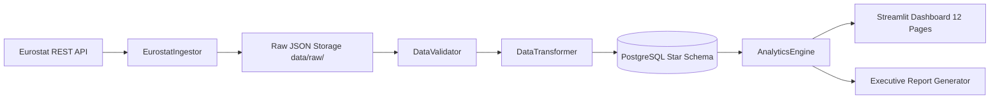

# European Energy Analytics

> **Official Eurostat Data Pipeline & Interactive Analytics Architecture for 37 European Nations**

[](https://www.python.org/downloads/)
[](https://www.postgresql.org/)
[](https://streamlit.io/)
[](https://ec.europa.eu/eurostat)
[]()
[](LICENSE)

---

## ⚡ Overview

**European Energy Analytics** is a production-quality, reproducible Data Engineering & Analytics platform designed to collect, validate, store, analyze, and visualize official European energy balances, retail power tariffs, population balances, and greenhouse gas air emissions across 37 European countries.

Built on strict **Numerical Truth Principles**, 100% of the numbers displayed across the 12 dashboard pages originate directly from official **Eurostat REST APIs** (`nrg_bal_c`, `nrg_cb_e`, `nrg_ind_ren`, `nrg_pc_204`, `nrg_pc_205`, `env_ac_ainah_r2`, `demo_pjan`) with zero synthetic fallbacks or hardcoded business metrics.

---

## 📌 Core Features

1. **Production ETL Pipeline (`pipeline_runner.py`)**:
   - Automated ingestion of Eurostat JSON-stat 2.0 matrices.
   - Comprehensive multi-stage data validator (`src/validation/data_validator.py`) testing bounds, nulls, duplicates, and ranges.
   - Star-schema dimensional data warehouse loaded into local PostgreSQL (`european_energy` DB).
2. **Dynamic 12-Page Streamlit Dashboard (`dashboard/`)**:
   - **1. Regional Overview**: High-level aggregate KPIs & regional energy mix.
   - **2. Country Comparison**: Multi-country generation & renewable share comparisons.
   - **3. Single Country Deep Dive**: Interactive 5-tab country profile for any selected European nation (e.g., Greece, Germany, France, Spain, Italy, Norway, Sweden, Poland) featuring energy mix donut charts, 35-year generation trends, retail price evolution, Sector D GHG air emissions, and CAGR growth benchmarks.
   - **4. Energy Mix Breakdown**: Fuel stream breakdown (Nuclear, Solar PV, Wind, Hydro, Biofuels, Natural Gas, Solid Fossil Fuels/Coal, Oil).
   - **5. Renewable Energy Rankings**: SHARES directive benchmarking & regional ranking tables.
   - **6. Electricity Price Analysis**: Biannual household vs. industrial electricity price trajectories (€/kWh).
   - **7. Consumption & Per Capita**: Electricity consumption & generation per capita (kWh/person).
   - **8. Power Sector Air Emissions**: Sector D GHG emissions (Mt CO₂eq) trajectory.
   - **9. Long-Term Trends & CAGR**: 5Y, 10Y, and 20Y Compound Annual Growth Rates.
   - **10. Forecasts & Projections**: OLS linear regression forecasting models explicitly tagged as `Forecast / Projection (NOT Fact)`.
   - **11. Executive Report Generator**: Automated multi-country markdown & PDF report generation.
   - **12. Data Sources & Metadata Register**: Data provenance tracking, dataset URLs, and licensing documentation.
3. **Automated Audit & Verification Engine (`audit/`)**:
   - `python3 audit/hardcode_audit.py`: Scans codebase for hardcoded factual numbers (0 found).
   - `python3 audit/numerical_truth_audit.py`: Tests 59 metric points against official source calculations (100% PASS).

---

## 🏛 Architecture & Data Lineage



### Official Sourced Eurostat Datasets
- **`nrg_bal_c`**: Complete Annual Energy Balances (Gross Electricity Production `GEP` by SIEC fuel source in GWh).
- **`nrg_cb_e`**: Annual Electricity Supply, Transformation, and Final Consumption (`FC` in GWh).
- **`nrg_ind_ren`**: Renewable Energy Shares (% `REN_ELC`).
- **`nrg_pc_204`**: Electricity prices for household consumers (EUR/kWh, bi-annual).
- **`nrg_pc_205`**: Electricity prices for industrial consumers (EUR/kWh, bi-annual).
- **`env_ac_ainah_r2`**: Greenhouse gas air emissions for Sector D (Thousand Tonnes CO₂eq).
- **`demo_pjan`**: Population on 1 January (Persons count).

---

## 🗄 Database Star Schema Architecture

The PostgreSQL warehouse contains 6 Fact tables and 3 Dimension tables (**22,612 fact records**):

- **`fact_energy_generation`**: Annual generation by fuel stream (14,172 rows)
- **`fact_energy_consumption`**: Annual consumption balances (2,427 rows)
- **`fact_energy_price`**: Biannual household & industrial tariffs (2,450 rows)
- **`fact_emissions`**: Sector D GHG air emissions (626 rows)
- **`fact_population`**: Official population on 1 January (2,230 rows)
- **`fact_renewable_share`**: Eurostat SHARES renewable percentage (707 rows)
- **`dim_country`**: 37 European countries with ISO-2 / Eurostat mappings
- **`dim_date`**: 1960–2025 date dimension
- **`dim_energy_source`**: 12 SIEC fuel streams & aggregate classifications

---

## 🚀 Quickstart & Installation

### 1. Prerequisites
- **Python**: `3.10` or higher
- **PostgreSQL**: `16+` running on port `5433` (or default `5432`)

### 2. Setup Environment
```bash
# Clone the repository
git clone https://github.com/tsakirisand/European-Energy-Analytics.git
cd European-Energy-Analytics

# Create and activate virtual environment
python3 -m venv venv
source venv/bin/activate

# Install dependencies
pip install -r requirements.txt
```

### 3. Initialize PostgreSQL Database & Run ETL Pipeline
```bash
# Execute end-to-end data pipeline (ingests Eurostat API -> validates -> loads DB)
python3 pipeline_runner.py
```

### 4. Launch Interactive Streamlit Dashboard
```bash
streamlit run dashboard/app.py
```
Open your browser at `http://localhost:8501`.

---

## 🧪 Testing & Data Quality Audits

Run the full pytest suite and automated numerical audit tools:

```bash
# Run PyTest unit & integration tests
python3 -m pytest tests/

# Run Hardcode Codebase Audit
python3 audit/hardcode_audit.py

# Run Full Source-to-Database Numerical Truth Audit
python3 audit/numerical_truth_audit.py
```

---

## 📁 Repository Structure

```
European-Energy-Analytics/
├── audit/
│   ├── hardcode_audit.py          # Scans source code for hardcoded numbers
│   └── numerical_truth_audit.py   # Validates DB metrics against mathematical truth
├── dashboard/
│   ├── app.py                     # Streamlit landing page
│   ├── components/                # Reusable UI components & KPI cards
│   └── pages/                     # 12 analytical dashboard pages
├── database/
│   ├── db_manager.py              # PostgreSQL SQLAlchemy connection manager
│   └── schema.sql                 # Star-schema DDL tables & indexes
├── data/
│   └── raw/                       # Cached raw Eurostat API JSON payloads
├── reports/
│   └── generator.py               # Dynamic Executive Report Generator
├── src/
│   ├── analytics/                 # Analytical SQL queries & AnalyticsEngine
│   ├── forecasting/               # OLS linear regression forecasting models
│   ├── ingestion/                 # Eurostat API REST client & JSON-stat decoder
│   ├── transformation/            # ETL dimensional mapping & PostgreSQL transformer
│   └── validation/                # Data bounds & quality validation rules
├── tests/                         # Pytest unit & integration test suite
├── pipeline_runner.py             # End-to-end pipeline orchestrator
├── requirements.txt               # Python package dependencies
└── README.md                      # Project documentation
```

---

## ⚖️ Data Provenance & Legal Licensing

All statistical data is sourced directly from **Eurostat (Statistical Office of the European Union)**. Eurostat data is free and open to re-use under the [Eurostat Copyright Notice](https://ec.europa.eu/eurostat/web/main/help/copyright-notice), subject to acknowledgment of the source.
